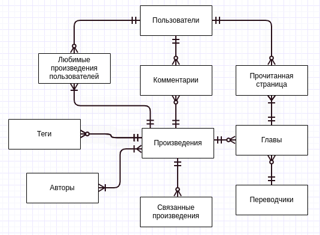
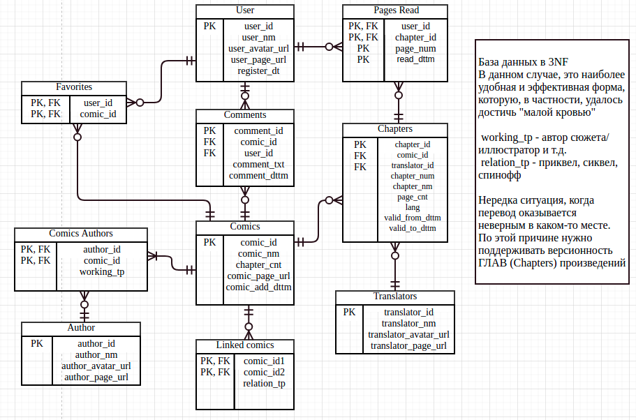

## Databases course project

#### Код для запуска в этом [файле](./code/mangareader_console.sql)
#### CSV файлы лежат в этой [директории](./data/inserts)
Достаточно будет скачать папку целиком и в коде через CTRL+R заменить /home/skushneryuk/study/databases/project/data/inserts на абсолютный путь до этой папки (хотел сделать удобнее для этого одну функцию, но не получилось)

### Progress

#### Entity-relationship diagram - done

#### Logical model - done

#### Physical model - done

[Физическая модель](./graph/physical_model.pdf)

#### Таблица - done

[Таблица и схема](./code/mangareader_console.sql)

#### Inserts - ready

#### Indexes - ready

#### Triggers - ready
